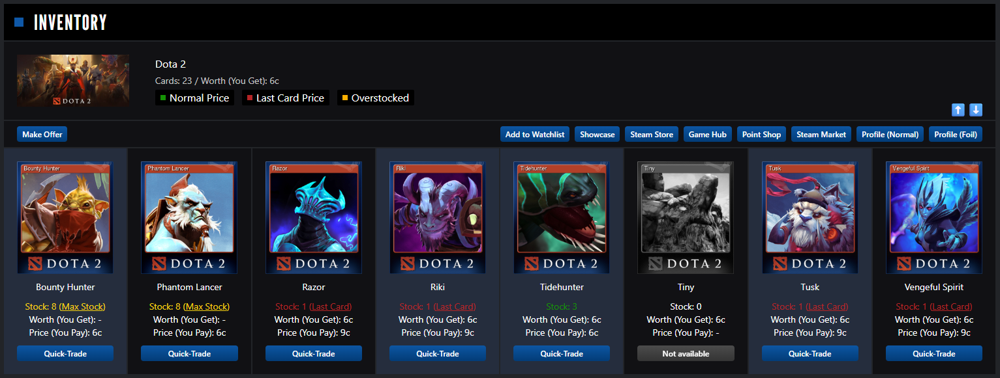

# SteamCardExchange Card Highlighter

A UserScript that allows you to highlight trading cards on [SteamCardExchange](https://www.steamcardexchange.net/) with a single click and export/import your wishlist.

## Features
- 🖱️ **One-click highlighting**: Click any card image to mark it.
- 💾 **Save data**: Highlights are saved automatically in your browser.
- 🔄 **Export/Import**: Backup your full list or transfer it to another browser using the ⬆️/⬇️ buttons.

## Installation
1. Install a userscript manager like **Tampermonkey** ([Chrome](https://chromewebstore.google.com/detail/tampermonkey/dhdgffkkebhmkfjojejmpbldmpobfkfo) / [Firefox](https://addons.mozilla.org/firefox/addon/tampermonkey/)).
2. [Install the script](https://github.com/kuvl/sce-card-highlighter/raw/refs/heads/main/sce-card-highlighter.user.js).

## How to use
1. Select game on [SteamCardExchange Inventory](https://www.steamcardexchange.net/index.php?inventory).
2. Click on card images to highlight them.
3. Use the ⬆️/⬇️ arrows in the top-right corner of the game info block to export or import your data.
